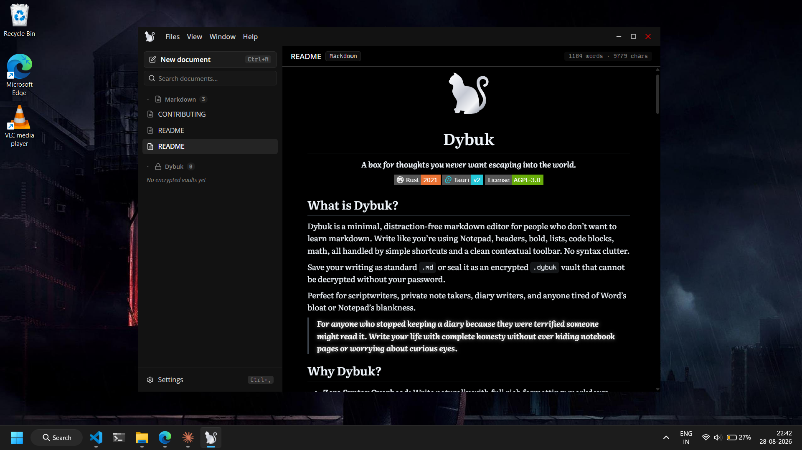
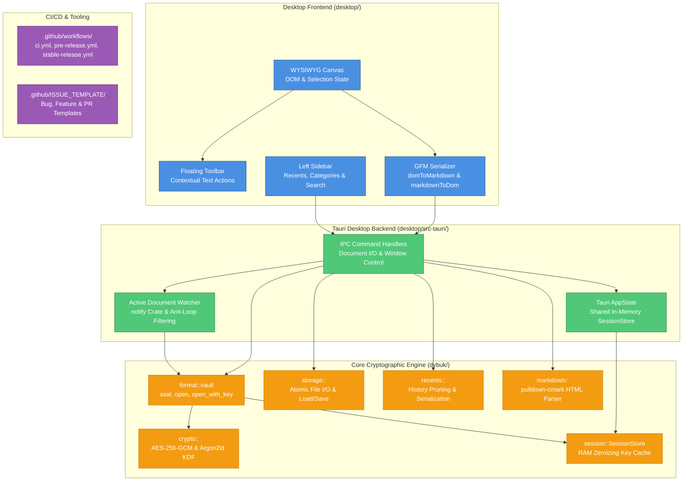

<div align="center">


# **Dybuk**

***A box for thoughts you never want escaping into the world.***

[](https://www.rust-lang.org/)
[](https://tauri.app/)
[](./LICENSE)



</div>

## **What is Dybuk?**

Dybuk is a minimal, distraction-free markdown editor for people who don’t want to learn markdown. Write like you’re using Notepad, headers, bold, lists, code blocks, math, all handled by simple shortcuts and a clean contextual toolbar. No syntax clutter.

Save your writing as standard `.md` or seal it as an encrypted `.dybuk` vault that cannot be decrypted without your password.

Perfect for scriptwriters, private note takers, diary writers, and anyone tired of Word’s bloat or Notepad’s blankness.

> [!NOTE]
> **For anyone who stopped keeping a diary because they were terrified someone might read it:** Write your life with complete honesty without hiding notebook pages or fearing curious eyes.

## **Why Dybuk?**

- **Zero Syntax Overhead:** Write naturally with full rich formatting; markdown serialization happens seamlessly behind the scenes.
- **Encrypted Vaults (`.dybuk`):** Lock your notes on disk using **military-grade AES-256-GCM** authenticated encryption and **Argon2id** password hashing.
- **Local-First & Offline:** Zero accounts, zero telemetry, no cloud sync, and no third-party tracking. Your data never leaves your machine.
- **Active Document Hot-Reloading:** Automatically watches the currently opened file on disk and hot-reloads edits made from VS Code, Notepad, or external scripts.
- **Sub-Millisecond Session Caching:** In-memory session keys allow instant reopening and saving of unlocked vaults without repeating expensive Argon2id computations.
- **RAM Zeroization:** All plaintext buffers, encryption keys, and credentials are wiped from RAM upon closing to prevent memory-dump attacks.

---

## 🛡️ The `.dybuk` Cryptographic Vault

Your writing doesn’t have to stay in plain `.md`. Save it as `.dybuk` and it becomes a 100% self-contained encrypted binary container:

```text
+---------------+-----------------+------------------+------------------+-----------------------+
| Magic (4 B)   | Version (1 B)   | Salt (16 B)      | Nonce (12 B)     | Ciphertext (variable) |
| "DYBK"        | 0x01            | CSPRNG Salt      | AES-GCM Nonce    | AES-256-GCM + 16B Tag |
+---------------+-----------------+------------------+------------------+-----------------------+
0               4                 5                  21                 33                     EOF
```

- **AES-256-GCM (Authenticated Encryption):** 256-bit symmetric encryption with a 128-bit authentication tag. Tampering with any byte causes decryption to fail immediately.
- **Argon2id (Memory-Hard Key Derivation):** Defeats GPU and ASIC brute-force password cracking rigs.
- **Portable & Isolated:** Carry your `.dybuk` files on flash drives, email them, or upload them to cloud storage. They remain fully encrypted everywhere they go.

---

## 📦 Monorepo Layout

Dybuk is organized as a Cargo workspace with clean separation between the frontend WYSIWYG editor, the native desktop shell, and the core cryptographic library.



### Directory Structure

```text
Dybuk/
├── desktop/                      # Tauri v2 Desktop Application
│   ├── src/                      # TypeScript frontend & UI
│   │   ├── css/                  # Dark-mode styling, tokens, and layouts
│   │   │   ├── titlebar/         # Frameless titlebar & dropdown menus
│   │   │   ├── left-sidebar/     # Recents list, search, and category pills
│   │   │   └── main-content/     # WYSIWYG canvas, floating toolbar, empty state
│   │   ├── ts/                   # TypeScript modules
│   │   │   ├── main-content/     # Canvas editor, GFM serializer, floating toolbar
│   │   │   ├── left-sidebar/     # Sidebar history controller & search filter
│   │   │   ├── titlebar/         # Window controls & state-aware file actions
│   │   │   └── shared/           # State subscriber, type definitions & IPC wrapper
│   │   ├── assets/               # Application SVGs, logo, and icons
│   │   └── index.html            # Main application window markup
│   │
│   ├── src-tauri/                # Rust backend for Tauri v2
│   │   ├── src/
│   │   │   ├── sidebar/          # Document I/O, recents, and session unlock commands
│   │   │   ├── titlebar/         # Window dragging, minimization, and file dialogs
│   │   │   ├── watcher/          # Active document file watcher (notify crate)
│   │   │   ├── main_content/     # Markdown compilation endpoint
│   │   │   └── lib.rs            # Tauri builder & handler registration
│   │   ├── Cargo.toml            # dybuk-desktop package definition
│   │   └── tauri.conf.json       # Tauri window, security, and bundle configuration
│   ├── package.json              # TypeScript dependencies & build scripts
│   └── tsconfig.json             # TypeScript compiler settings
│
├── dybuk/                        # Core Cryptographic Library (Rust)
│   ├── src/
│   │   ├── crypto/               # AES-256-GCM cipher & Argon2id key derivation
│   │   ├── format/               # .dybuk binary container serialization (seal/open)
│   │   ├── session/              # In-memory zeroizing session key cache (SessionStore)
│   │   ├── storage/              # Plaintext markdown file loading & atomic writing
│   │   ├── recents/              # Persistent recents store tracking & auto-pruning
│   │   ├── markdown/             # pulldown-cmark HTML parsing engine
│   │   ├── document.rs           # Unified document creation dispatcher
│   │   └── lib.rs                # Library exports & public APIs
│   └── Cargo.toml                # dybuk core crate definition
│
├── assets/                       # Brand logo & graphics
├── .github/                      # GitHub Actions CI/CD workflows & issue templates
│   ├── workflows/                # ci.yml, pre-release.yml, stable-release.yml
│   └── ISSUE_TEMPLATE/           # bug_report.yml, feature_request.yml, config.yml
├── CHANGELOG.md                  # Semantic version history (Keep a Changelog)
├── CONTRIBUTING.md               # Developer setup & contribution guidelines
├── SECURITY.md                   # Cryptographic vulnerability disclosure policy
├── Cargo.toml                    # Workspace root definition
└── README.md                     # This file
```

---

## 🚀 Getting Started

### For Users

> Don’t want to build Dybuk yourself? Download the latest pre-built release and start writing:
>
> **[→ Download Dybuk](https://github.com/lukagray-dev/Dybuk/releases)**

### For Developers

Want to build Dybuk from source or contribute to the project?

#### 1. Prerequisites

- **Rust:** `1.84+` (stable toolchain with MSVC on Windows)
- **Node.js:** `v20+` and `npm`

#### 2. Clone the Repository

```bash
git clone https://github.com/lukagray-dev/Dybuk.git
cd Dybuk
```

#### 3. Run in Development Mode

```bash
cd desktop
npm install
npm run tauri dev
```

#### 4. Run the Test Suite

```bash
# Run all 53 unit tests and 10 doc-tests across the workspace
cargo test --workspace

# Run linter
cargo clippy --workspace -- -D warnings
```

#### 5. Build Production Release Binary

```bash
cargo build --release -p dybuk-desktop
```

The optimized standalone executable will be generated at `target/release/dybuk-desktop.exe`.

---

## License & Contributing

Dybuk is licensed under the **GNU Affero General Public License v3.0 (AGPLv3)**. See [LICENSE](./LICENSE) for full terms.

Contributions are welcome. If you’re planning a large feature or architectural change, open an issue first to align before implementation begins. See [CONTRIBUTING](./CONTRIBUTING.md) for more information.

---

<div align="center">

Built by **Luka Gray (aka Soumo Mukherjee)** • West Bengal, India • 2026

*“The best tools disappear. You stop thinking about the tool and start thinking about the work.”*

**[GitHub](https://github.com/lukagray-dev) • [Instagram](https://www.instagram.com/lukagray.official) • [Email](mailto:heylukagray@gmail.com)**

</div>