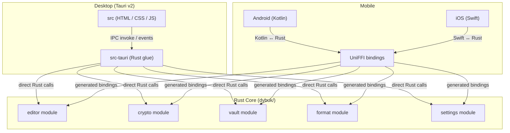

# Architecture

This document defines the technical architecture of Dybuk: the system boundaries, crate structure, platform integration contracts, data flows, and dependency decisions. It is the authoritative reference for anyone implementing or reviewing the codebase.

## System Overview

Dybuk follows a **shared-core** architecture. A single Rust library (`dybuk/`) owns all business logic, cryptography, markdown processing, and file I/O. Platform-specific shells (Tauri for desktop, native Kotlin for Android, native Swift for iOS) provide the UI and operating system integration, delegating all meaningful computation to the Rust core.



### Key Architectural Constraint

**The Rust core is the single source of truth for all logic.** The desktop and mobile shells are presentation layers only. They must never implement their own markdown parsing, encryption, or file format handling. If a feature requires logic, it goes in `dybuk/`.

## Repo Layout

```text
Dybuk/
├── assets/          # shared assets for UI
├── desktop/         # tauri desktop app
├── docs/            # documentations
├── dybuk/           # core rust bankend
├── mobile/
    ├── android/     # android frontend
    ├── ios/         # iOS frontend
    └── README.md
├── scripts/         # batch scripts
├── .gitignore
├── AGENTS.md
├── Cargo.lock
├── Cargo.toml       # workspace level Cargo file
├── other documentations...
```

## Build & CI Pipeline

### Workspace Structure

The root `Cargo.toml` defines a Rust workspace, it will include all the deps that other crated will call form.

The mobile targets are not workspace members, they are compiled separately via their respective platform build systems (Gradle for Android, Xcode for iOS), which invoke `cargo build` as a build step.
