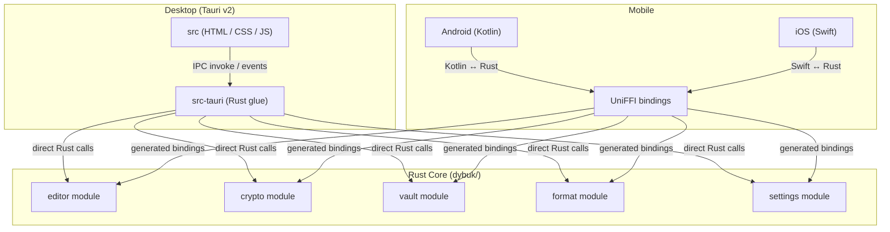
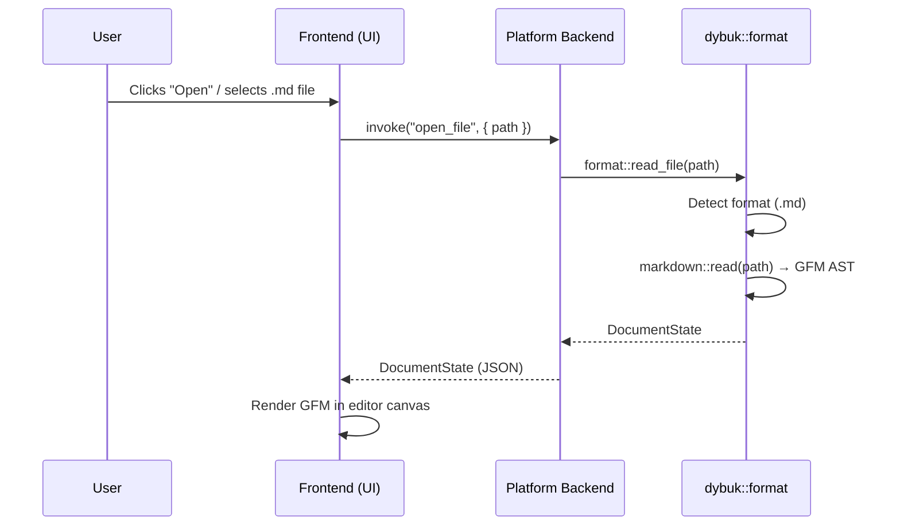
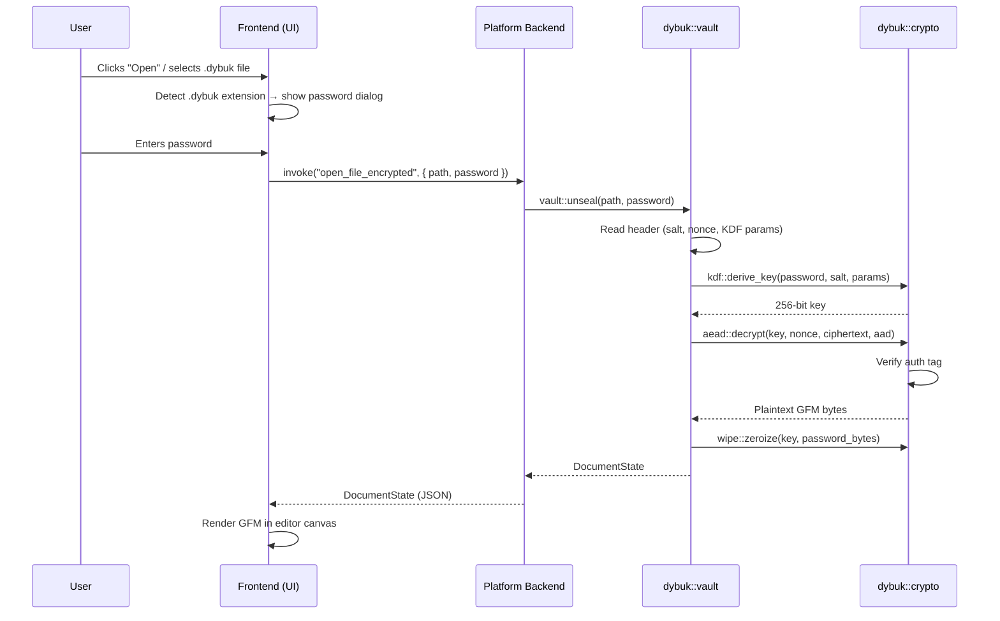
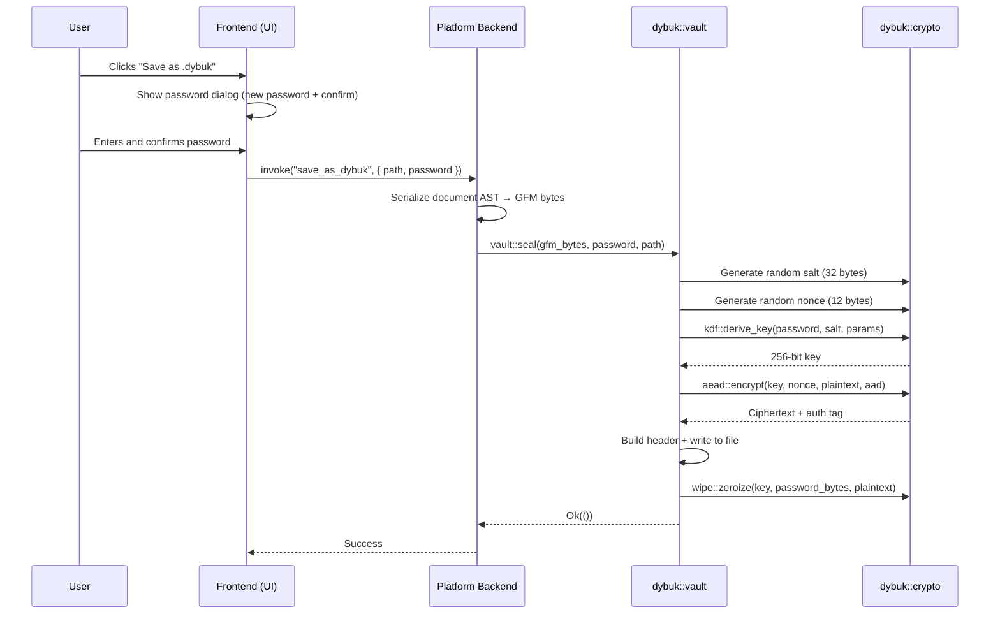

# Architecture

This document defines the technical architecture of Dybuk: the system boundaries, crate structure, platform integration contracts, data flows, and dependency decisions. It is the authoritative reference for anyone implementing or reviewing the codebase.

## System Overview

Dybuk follows a **shared-core** architecture. A single Rust library (`dybuk/`) owns all business logic, cryptography, markdown processing, and file I/O. Platform-specific shells (Tauri for desktop, native Kotlin for Android, native Swift for iOS) provide the UI and operating system integration, delegating all meaningful computation to the Rust core.



### Key Architectural Constraint

**The Rust core is the single source of truth for all logic.** The desktop and mobile shells are presentation layers only. They must never implement their own markdown parsing, encryption, or file format handling. If a feature requires logic, it goes in `dybuk/`.

---

## Rust Core (`dybuk/`)

The core is a Rust library crate published as part of the workspace. It exposes a public API consumed by the Tauri backend and UniFFI bindings.

### Module Layout

```
dybuk/
├── Cargo.toml
└── src/
    ├── lib.rs              # Public API surface, re-exports
    ├── editor/
    │   ├── mod.rs           # Editor state machine, document model
    │   ├── document.rs      # In-memory document representation (GFM AST)
    │   ├── operations.rs    # Insert, delete, format operations on the document
    │   └── selection.rs     # Cursor and selection range management
    ├── crypto/
    │   ├── mod.rs           # Public encrypt/decrypt API
    │   ├── kdf.rs           # Argon2id key derivation (password → 256-bit key)
    │   ├── aead.rs          # AES-256-GCM authenticated encryption/decryption
    │   └── wipe.rs          # Zeroization helpers for sensitive memory
    ├── vault/
    │   ├── mod.rs           # High-level vault operations (seal, unseal)
    │   ├── header.rs        # .dybuk file header serialization/deserialization
    │   └── integrity.rs     # File integrity checks (magic bytes, version, tag)
    ├── format/
    │   ├── mod.rs           # Format detection, read/write dispatch
    │   ├── markdown.rs      # GFM read/write (plain .md files)
    │   └── dybuk.rs         # .dybuk binary format read/write
    ├── settings/
    │   ├── mod.rs           # User preferences (theme, font size, editor behavior)
    │   └── schema.rs        # Settings schema and validation
    └── error.rs             # Unified error types for the entire crate
```

### Module Responsibilities

#### `editor`

Manages the in-memory document state. The document is represented as a GFM abstract syntax tree (AST). All editing operations (insert text, toggle bold, change heading level, etc.) are expressed as transformations on this AST. The editor module never touches the filesystem — it operates purely on in-memory state.

- **`document.rs`**: Holds the root AST node and metadata (cursor position, unsaved-changes flag, file path if opened from disk).
- **`operations.rs`**: Stateless functions that accept a document and an operation descriptor, returning a new document state. Each operation is atomic and deterministic.
- **`selection.rs`**: Manages cursor position (line, column), selection ranges, and multi-cursor logic (if ever added).

#### `crypto`

Implements the cryptographic primitives. This module is the only code in the entire system that handles key material.

- **`kdf.rs`**: Wraps Argon2id. Accepts a password and a random salt, returns a 256-bit derived key. Parameters are hardcoded to the current OWASP baseline (m=19456 KiB, t=2, p=1) and embedded in the `.dybuk` file header so files remain self-describing.
- **`aead.rs`**: Wraps AES-256-GCM. Accepts a key, a 12-byte nonce, optional AAD, and plaintext. Returns ciphertext concatenated with the 16-byte authentication tag. Decryption verifies the tag before returning plaintext — if verification fails, the entire output is discarded.
- **`wipe.rs`**: Provides helpers that use the `zeroize` crate to overwrite key material, plaintext buffers, and password strings in memory immediately after use. Every function in `crypto` that handles secrets must call into `wipe` on all exit paths, including error paths.

#### `vault`

High-level orchestration for `.dybuk` file operations. This module composes `crypto` and `format` to implement the full seal/unseal pipeline.

- **`header.rs`**: Serializes and deserializes the `.dybuk` binary header (magic bytes, version, KDF parameters, salt, nonce). See [FILE_FORMAT.md](./FILE_FORMAT.md) for the byte-level specification.
- **`integrity.rs`**: Pre-flight checks before attempting decryption — validates magic bytes, version compatibility, minimum file size, and header field ranges.

#### `format`

Handles reading and writing files to/from the two supported formats.

- **`markdown.rs`**: Reads a `.md` file from disk into the editor's document model (GFM AST). Writes the AST back to disk as GFM text. Uses `github-markdown-css` compatible output.
- **`dybuk.rs`**: Reads a `.dybuk` file by delegating to `vault::unseal`, then parsing the decrypted GFM content. Writes by serializing the AST to GFM text, then delegating to `vault::seal`.

#### `settings`

Manages user preferences persisted as a local configuration file.

- **`schema.rs`**: Defines the settings structure (theme, font family, font size, line height, editor mode flags like focus mode and typewriter mode). Includes validation logic and default values.

#### `error`

A single `DybukError` enum covering all failure modes across the crate. Each variant carries enough context for the UI layer to display a meaningful, non-technical message to the user. Variants include:

- `IoError` — filesystem read/write failure
- `InvalidFormat` — file is not a valid `.dybuk` file (bad magic, unsupported version)
- `DecryptionFailed` — wrong password or corrupted ciphertext (auth tag mismatch)
- `SerializationError` — settings or header marshalling failure
- `EditorError` — invalid operation on the current document state

---

## Desktop Integration (Tauri v2)

The desktop application uses Tauri v2, which provides a native application window backed by the operating system's webview (WebView2 on Windows, WebKit on macOS, WebKitGTK on Linux).

### Directory Structure

```
desktop/
├── src/                    # Frontend assets
│   ├── index.html          # Single-page application entry point
│   ├── styles/
│   │   ├── reset.css       # CSS reset / normalize
│   │   ├── variables.css   # Design tokens (colors, spacing, typography)
│   │   ├── layout.css      # Editor layout, toolbar, status bar
│   │   ├── editor.css      # Editor canvas and inline rendering styles
│   │   └── github-markdown.css  # GFM rendering stylesheet
│   └── js/
│       ├── main.js         # Application entry, event wiring
│       ├── editor.js       # Editor DOM management, contenteditable logic
│       ├── toolbar.js      # Toolbar rendering and shortcut dispatch
│       ├── ipc.js          # Tauri invoke/event wrappers
│       ├── vault-ui.js     # Password dialog, encrypt/decrypt UI flows
│       └── settings-ui.js  # Settings panel rendering
├── src-tauri/
│   ├── Cargo.toml          # Tauri backend dependencies (tauri, dybuk)
│   ├── tauri.conf.json     # Tauri application configuration
│   ├── capabilities/       # Permission/capability definitions
│   │   ├── main-window.json
│   │   └── default.json
│   ├── src/
│   │   ├── main.rs         # Tauri entry point, command registration
│   │   ├── commands/
│   │   │   ├── mod.rs      # Command module aggregation
│   │   │   ├── file.rs     # open_file, save_file, save_as_dybuk commands
│   │   │   ├── editor.rs   # apply_operation, get_document_state commands
│   │   │   ├── crypto.rs   # encrypt_file, decrypt_file commands
│   │   │   └── settings.rs # get_settings, update_settings commands
│   │   └── state.rs        # Tauri managed state (holds dybuk::Document)
│   └── icons/              # Application icons (all platforms)
└── package.json            # Frontend dev dependencies (dev server only)
```

### IPC Contract

The frontend communicates with the Rust backend exclusively through Tauri's IPC system. Two mechanisms are used:

#### Commands (Request → Response)

Commands are Rust functions annotated with `#[tauri::command]` and registered in the Tauri `invoke_handler`. The frontend calls them via `invoke()` from `@tauri-apps/api/core`.

| Command | Direction | Arguments | Returns | Purpose |
|:---|:---|:---|:---|:---|
| `open_file` | Frontend → Backend | `path: String` | `DocumentState` | Open a `.md` or `.dybuk` file. For `.dybuk`, triggers password prompt first. |
| `open_file_encrypted` | Frontend → Backend | `path: String, password: String` | `DocumentState` | Open a `.dybuk` file with the provided password. |
| `save_file` | Frontend → Backend | — | `()` | Save the current document to its original path and format. |
| `save_file_as` | Frontend → Backend | `path: String` | `()` | Save the current document to a new path as `.md`. |
| `save_as_dybuk` | Frontend → Backend | `path: String, password: String` | `()` | Encrypt and save the current document as `.dybuk`. |
| `apply_operation` | Frontend → Backend | `op: EditorOperation` | `DocumentState` | Apply a formatting or editing operation to the document. |
| `get_document_state` | Frontend → Backend | — | `DocumentState` | Retrieve the current document state for rendering. |
| `get_settings` | Frontend → Backend | — | `Settings` | Retrieve current user settings. |
| `update_settings` | Frontend → Backend | `settings: Settings` | `()` | Persist updated user settings. |
| `new_file` | Frontend → Backend | — | `DocumentState` | Create a new, empty document. |

#### Events (Fire-and-Forget)

Events are used for asynchronous, unidirectional notifications.

| Event | Direction | Payload | Purpose |
|:---|:---|:---|:---|
| `document-changed` | Backend → Frontend | `DocumentState` | Notify the frontend that the document state changed (e.g., after a background operation). |
| `save-progress` | Backend → Frontend | `{ stage: String, percent: u8 }` | Progress updates during encryption of large files. |
| `error-occurred` | Backend → Frontend | `{ code: String, message: String }` | Non-fatal errors that the UI should display. |

### Tauri Capabilities & Permissions

Dybuk uses Tauri v2's capabilities system to enforce least-privilege access. The frontend has **zero** system access unless explicitly granted.

**`capabilities/main-window.json`** grants the main editor window:

- `fs:allow-read-file` — scoped to user-selected paths (via the OS file dialog)
- `fs:allow-write-file` — scoped to user-selected paths
- `dialog:allow-open` — native file open dialog
- `dialog:allow-save` — native file save dialog
- `window:allow-close` — close the application window
- `window:allow-minimize` — minimize the application window
- `window:allow-set-title` — update the window title bar with the file name

No other permissions are granted. Specifically:

- **No network access.** No `http:` or `websocket:` capabilities are granted.
- **No shell access.** No `shell:` capabilities are granted.
- **No clipboard by default.** Clipboard access (`clipboard-manager:allow-read`, `clipboard-manager:allow-write`) may be added later if copy/paste requires it, but it is not granted initially.

### Frontend Technology

The frontend is built with plain HTML, vanilla CSS, and vanilla JavaScript. No framework (React, Vue, Svelte) is used. This is a deliberate decision:

- The UI is simple enough (one editor canvas, one toolbar, one settings panel) that a framework adds complexity without proportional benefit.
- Eliminating the framework dependency reduces the build toolchain, attack surface, and bundle size.
- GFM rendering uses `github-markdown.css` for consistent, battle-tested styling of the rendered document.

---

## Mobile Integration (UniFFI)

Mobile applications consume the same Rust core via Mozilla's **UniFFI**. UniFFI generates native-feeling Kotlin and Swift bindings from the Rust interface definition, eliminating manual C-FFI boilerplate.

### How It Works

1. **Interface definition**: The public API of `dybuk/` is annotated with UniFFI proc-macros (or described in a `.udl` file). This defines which types, functions, and enums are exposed to foreign languages.
2. **Scaffolding generation**: UniFFI generates Rust "scaffolding" code that handles serialization across the FFI boundary.
3. **Binding generation**: UniFFI generates Kotlin source files (for Android) and Swift source files (for iOS) that wrap the native calls in idiomatic types.
4. **Compilation**: The Rust core is compiled to platform-specific shared libraries.

### Android (Kotlin)

```
mobile/
└── android/
    ├── app/
    │   ├── src/main/
    │   │   ├── java/dev/lukagray/dybuk/   # Kotlin UI code
    │   │   │   ├── MainActivity.kt
    │   │   │   ├── EditorActivity.kt
    │   │   │   ├── VaultDialogFragment.kt
    │   │   │   └── SettingsActivity.kt
    │   │   ├── res/                         # Android resources (layouts, drawables, values)
    │   │   └── jniLibs/                     # Compiled .so files (arm64-v8a, armeabi-v7a, x86_64)
    │   └── build.gradle.kts
    ├── uniffi-bindings/                     # Generated Kotlin bindings
    └── build.gradle.kts                     # Root build file
```

**Compilation targets:**
- `aarch64-linux-android` (ARM64, most modern phones)
- `armv7-linux-androideabi` (ARMv7, older devices)
- `x86_64-linux-android` (emulators)

The compiled `.so` files are placed in `jniLibs/` under the appropriate ABI directory. The UniFFI-generated Kotlin bindings are placed in a source set so they can be imported directly in the Kotlin UI code.

### iOS (Swift)

```
mobile/
└── ios/
    ├── Dybuk/
    │   ├── DybukApp.swift              # SwiftUI app entry point
    │   ├── Views/
    │   │   ├── EditorView.swift
    │   │   ├── VaultSheet.swift
    │   │   └── SettingsView.swift
    │   ├── Resources/                   # Asset catalogs, storyboards
    │   └── Info.plist
    ├── DybukCore.xcframework/           # Pre-built XCFramework containing the Rust library
    ├── uniffi-bindings/                 # Generated Swift bindings
    └── Dybuk.xcodeproj
```

**Compilation targets:**
- `aarch64-apple-ios` (physical devices)
- `aarch64-apple-ios-sim` (Apple Silicon simulators)
- `x86_64-apple-ios` (Intel simulators)

The compiled static library is bundled into an `XCFramework` that the Xcode project links against. The UniFFI-generated Swift bindings are added as source files to the Xcode target.

### UniFFI Interface Boundary

The UniFFI-exposed API is a **subset** of the full `dybuk` crate API. Only types and functions needed by the mobile UI are exposed:

```rust
// Simplified illustration of the exposed interface

#[derive(uniffi::Record)]
pub struct DocumentState {
    pub content_gfm: String,      // Rendered GFM text
    pub cursor_line: u32,
    pub cursor_column: u32,
    pub is_modified: bool,
    pub file_path: Option<String>,
    pub is_encrypted: bool,
}

#[derive(uniffi::Enum)]
pub enum EditorOperation {
    InsertText { text: String },
    ToggleBold,
    ToggleItalic,
    SetHeading { level: u8 },
    ToggleBlockQuote,
    ToggleCodeBlock,
    ToggleUnorderedList,
    ToggleOrderedList,
    Undo,
    Redo,
}

#[uniffi::export]
pub fn new_document() -> DocumentState { /* ... */ }

#[uniffi::export]
pub fn open_markdown(path: &str) -> Result<DocumentState, DybukError> { /* ... */ }

#[uniffi::export]
pub fn open_dybuk(path: &str, password: &str) -> Result<DocumentState, DybukError> { /* ... */ }

#[uniffi::export]
pub fn save_markdown(state: &DocumentState, path: &str) -> Result<(), DybukError> { /* ... */ }

#[uniffi::export]
pub fn save_as_dybuk(state: &DocumentState, path: &str, password: &str) -> Result<(), DybukError> { /* ... */ }

#[uniffi::export]
pub fn apply_operation(state: &DocumentState, op: EditorOperation) -> Result<DocumentState, DybukError> { /* ... */ }
```

This ensures the mobile shells remain thin presentation layers with no business logic.

---

## Data Flow Diagrams

### Open a `.md` File



### Open a `.dybuk` File



### Save as `.dybuk`



---

## Dependency Strategy

### Cryptographic Libraries

| Crate | Purpose | Rationale |
|:---|:---|:---|
| `aes-gcm` (RustCrypto) | AES-256-GCM authenticated encryption | Pure Rust, `no_std` compatible, portable across all compilation targets (desktop + Android + iOS). Avoids linking issues with C/assembly on mobile cross-compilation. |
| `argon2` (RustCrypto) | Argon2id key derivation | Same ecosystem as `aes-gcm`, consistent API patterns, pure Rust portability. |
| `rand` | CSPRNG for salt and nonce generation | De facto standard for randomness in Rust. Uses OS-provided entropy source. |
| `zeroize` | Secure memory wiping | Ensures derived keys, passwords, and decrypted plaintext are overwritten in memory after use. Prevents secrets lingering in deallocated heap. |

**Why RustCrypto over `ring`?** Portability. The `ring` crate relies on C and assembly code that introduces cross-compilation complexity for Android and iOS targets. Since Dybuk must compile the same crypto code for 6+ targets (3 desktop, 3 Android, 3 iOS), a pure-Rust implementation eliminates an entire class of build failures.

### Non-Cryptographic Libraries

| Crate | Purpose |
|:---|:---|
| `serde` + `serde_json` | Serialization for settings, IPC payloads, and UniFFI records |
| `thiserror` | Ergonomic error type derivation for `DybukError` |
| `uniffi` | Foreign function interface generation for Kotlin and Swift |
| `tauri` | Desktop application framework (used only in `desktop/src-tauri`) |

### Dependency Principles

1. **Minimize the dependency tree.** Every crate added is code that must be audited, maintained, and compiled for all targets.
2. **Prefer pure Rust.** C/assembly dependencies create cross-compilation friction for 9+ targets.
3. **Pin major versions.** Use `Cargo.lock` and exact version constraints for cryptographic crates. A silent minor-version update in a crypto crate could introduce subtle behavioral changes.
4. **Audit regularly.** Run `cargo audit` in CI to catch known vulnerabilities in dependencies.

---

## Build & CI Pipeline

### Workspace Structure

The root `Cargo.toml` defines a Rust workspace:

```toml
[workspace]
members = [
    "dybuk",
    "desktop/src-tauri",
]
resolver = "2"
```

The mobile targets are not workspace members — they are compiled separately via their respective platform build systems (Gradle for Android, Xcode for iOS), which invoke `cargo build` as a build step.

### Cross-Compilation Targets

| Platform | Target Triple | Output |
|:---|:---|:---|
| Windows (x86_64) | `x86_64-pc-windows-msvc` | `.exe` (Tauri installer) |
| macOS (Apple Silicon) | `aarch64-apple-darwin` | `.app` bundle (Tauri DMG) |
| Linux (x86_64) | `x86_64-unknown-linux-gnu` | AppImage / `.deb` (Tauri) |
| Android (ARM64) | `aarch64-linux-android` | `libdybuk.so` |
| Android (ARMv7) | `armv7-linux-androideabi` | `libdybuk.so` |
| Android (x86_64) | `x86_64-linux-android` | `libdybuk.so` |
| iOS (device) | `aarch64-apple-ios` | `libdybuk.a` → XCFramework |
| iOS (sim, Apple Silicon) | `aarch64-apple-ios-sim` | `libdybuk.a` → XCFramework |
| iOS (sim, Intel) | `x86_64-apple-ios` | `libdybuk.a` → XCFramework |

### GitHub Actions Workflows

| Workflow | Trigger | Steps |
|:---|:---|:---|
| **CI (core)** | Push to `dev`, PR to `dev` | `cargo fmt --check` → `cargo clippy` → `cargo test --workspace` → `cargo audit` |
| **CI (desktop)** | Push to `dev`, PR to `dev` | Install Tauri prerequisites → `cargo tauri build --debug` (matrix: Windows, macOS, Linux) |
| **Release** | Push to `main` | Full `cargo tauri build --release` → sign binaries → create GitHub Release with assets |

Mobile CI is handled separately once the Android and iOS projects are set up, using their respective platform CI tools (Gradle for Android, Xcode Cloud or Fastlane for iOS).
