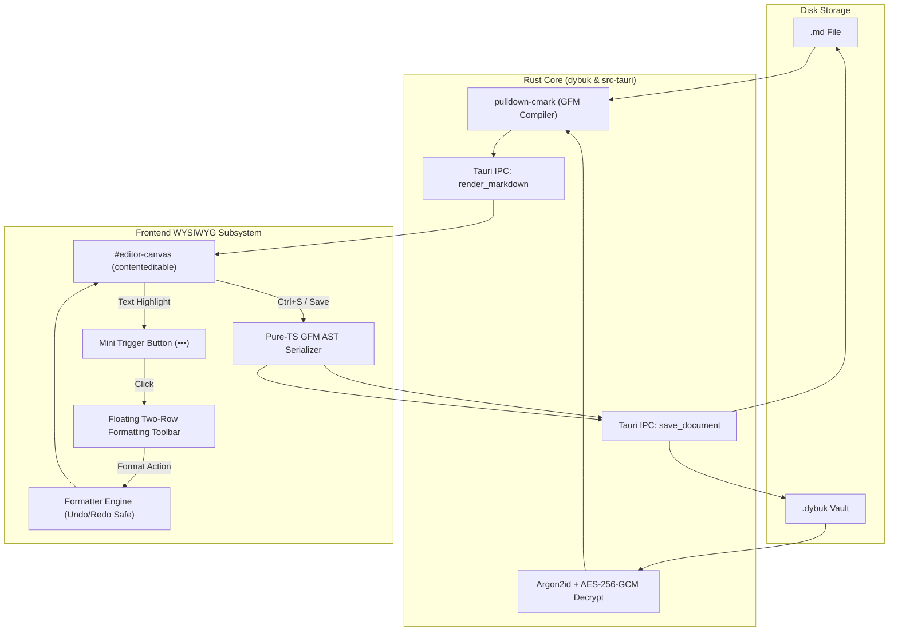

# Floating Toolbar & WYSIWYG Markdown Editing Architecture

This document describes the design, mechanics, and data flow of Dybuk's **Zero-Dependency WYSIWYG Editor** and its **Two-Row Floating Formatting Toolbar**.

---

## 1. Design Philosophy

Dybuk is designed for writers who want the portability and permanence of standard Markdown without the visual friction of raw syntax (`#`, `**`, `~~`, `` ` ``).

- **Zero Syntax in the Canvas**: When opened, documents are compiled into semantic HTML. Users interact with styled typography, real tables, clickable task checkboxes, and formatted code blocks.
- **Distraction-Free Interaction**: The editor canvas has no static, heavy ribbon or toolbar pinned to the window. Formatting controls appear only when text is highlighted.
- **Deterministic Disk Persistence**: On save, the live DOM tree is serialized back into clean, standardized GitHub-Flavored Markdown (GFM) before writing to `.md` files or sealing into encrypted `.dybuk` vaults.

---

## 2. System Architecture & Data Flow



---

## 3. Two-Stage, Double-Lined Floating Toolbar UX

The floating formatting system operates in two progressive stages to minimize visual distraction while providing immediate formatting capabilities:

```
[The quick brown fox] ❲•••❳  <── Stage 1: Mini Trigger (Selection End)
         │
         ▼ (Click Trigger)
┌───────────────────────────────────────────────────────────┐
│ Row 1:  B   I   S   ` `  🔗  √x │ 🎨  🖍  <kbd>  X₂  X²  ⌫   │  <── Stage 2: Expanded Two-Row Toolbar
│ Row 2:  H ▾ │ •  1.  ☑  "  ⚠️ ▾ │ ```  🪟  ──  ☰ ▾          │
└───────────────────────────────────────────────────────────┘
```

### Stage 1: Selection Detection & Mini Trigger (`•••`)
1. The toolbar listens to `selectionchange`, `mouseup`, and `keyup` events across the document.
2. If a non-collapsed selection is made within `#editor-canvas`:
   - The selection's bounding box is calculated via `range.getBoundingClientRect()`.
   - A compact pill button (`#floating-trigger`) containing a vector `•••` icon is positioned near the end of the selection.
   - Trigger coordinates are clamped within the viewport boundaries to prevent clipping.

### Stage 2: Expanded Two-Row Bubble Toolbar Menu
1. Clicking the mini trigger expands the full floating toolbar (`#floating-toolbar.double-row`).
2. The toolbar is positioned centered directly above the selection.
3. The editor inspects the active DOM node tree (`getActiveFormatState`) and synchronizes active button highlights and dropdown labels.

### Selection Loss Prevention
A critical challenge in WYSIWYG editors is that clicking toolbar buttons can cause the browser to shift focus away from the canvas, collapsing the text selection before the command runs.

Dybuk solves this by:
- Intercepting `mousedown` on toolbar buttons with `e.preventDefault()`.
- Caching the active `Range` on selection change (`savedRange = range.cloneRange()`).
- Explicitly calling `restoreSelection()` prior to executing any formatting command.

---

## 4. Complete Formatting Toolset

The formatting engine provides inline and block-level transformations while preserving the browser's native Undo/Redo stack (<kbd>Ctrl+Z</kbd> / <kbd>Ctrl+Y</kbd>):

### Row 1: Inline Typography, Rich Effects & Math

| Tool | Action | Shortcut | Output Element / Markdown Representation |
| :--- | :--- | :--- | :--- |
| **Bold** | `toggleBold()` | <kbd>Ctrl+B</kbd> | `<strong>...</strong>` $\rightarrow$ `**text**` |
| **Italic** | `toggleItalic()` | <kbd>Ctrl+I</kbd> | `<em>...</em>` $\rightarrow$ `*text*` |
| **Strikethrough** | `toggleStrikethrough()` | <kbd>Ctrl+Shift+X</kbd> | `<del>...</del>` $\rightarrow$ `~~text~~` |
| **Inline Code** | `toggleInlineCode()` | <kbd>Ctrl+`</kbd> | `<code>...</code>` $\rightarrow$ `` `text` `` |
| **Link** | `applyLink(url)` | <kbd>Ctrl+K</kbd> | `<a href="...">...</a>` $\rightarrow$ `[text](url)` |
| **LaTeX Math** | `applyMath(tex, isDisplay)` | <kbd>Ctrl+M</kbd> | `<span class="math math-inline">` $\rightarrow$ `$formula$` / `$$formula$$` |
| **Color & Glow** | `applyTextColorAndGlow(col, glow)` | <kbd>Ctrl+Shift+C</kbd> | `<span style="color: ...; text-shadow: ...;">` |
| **Highlighter** | `applyHighlight(color)` | <kbd>Ctrl+Shift+H</kbd> | `<mark style="background-color: ...;">` |
| **Keycap Badge** | `toggleKbd()` | — | `<kbd>Key</kbd>` |
| **Subscript** | `toggleSubscript()` | <kbd>Ctrl+,</kbd> | `<sub>...</sub>` |
| **Superscript** | `toggleSuperscript()` | <kbd>Ctrl+.</kbd> | `<sup>...</sup>` |
| **Clear Format** | `clearFormatting()` | — | Strips all inline formatting tags |

### Row 2: Block Structure, Lists, Callouts & Layout

| Tool | Action | Shortcut | Output Element / Markdown Representation |
| :--- | :--- | :--- | :--- |
| **Headings Dropdown** | `applyHeading(1-6)` | — | `<h1>` through `<h6>` $\rightarrow$ `# ` to `###### ` |
| **Bullet List** | `toggleBulletList()` | — | `<ul><li>...</li></ul>` $\rightarrow$ `- item` |
| **Numbered List**| `toggleNumberedList()` | — | `<ol><li>...</li></ol>` $\rightarrow$ `1. item` |
| **Task List** | `toggleTaskList()` | — | `<ul class="contains-task-list"><li class="task-list-item"><input type="checkbox"> ...</li></ul>` $\rightarrow$ `- [x] item` |
| **Blockquote** | `toggleBlockquote()` | — | `<blockquote>...</blockquote>` $\rightarrow$ `> quote` |
| **GitHub Alerts** | `applyGitHubAlert(type)` | — | `.markdown-alert` $\rightarrow$ `> [!NOTE]`, `> [!WARNING]`, etc. |
| **Code Block** | `insertCodeBlock()` | — | `<pre><code class="language-...">...</code></pre>` $\rightarrow$ ```` ```lang\ncode\n``` ```` |
| **Collapsible Details** | `insertDetailsSpoiler()` | — | `<details><summary>Title</summary>...</details>` |
| **Horizontal Rule** | `insertHorizontalRule()` | — | `<hr>` $\rightarrow$ `---` |
| **Alignment** | `applyAlignment(align)` | — | `<div align="center">...</div>` |

---

## 5. Interactive Popover Workflows

1. **Link Popover (`#toolbar-link-popover`)**: Pre-populates existing URLs when selection is inside an `<a>` tag. Pressing <kbd>Enter</kbd> applies the link with secure target/rel attributes.
2. **LaTeX Math Popover (`#toolbar-math-popover`)**: Features **live KaTeX preview**, display mode toggle (`$$`), and bidirectional serialization to `$formula$` / `$$formula$$`.
3. **Color & Neon Glow Popover (`#toolbar-color-popover`)**: Curated GitHub Dark palette swatches with 3-tier glow toggles (`None`, `Soft Glow`, `Neon Pulse`).
4. **Highlighter Marker Popover (`#toolbar-highlight-popover`)**: 5 translucent marker pen chips (Yellow, Green, Purple, Blue, Coral) with instant clear action.

---

## 6. Bidirectional Serialization Pipeline

```
Markdown Source ──► [pulldown-cmark (Rust)] ──► Semantic HTML ──► [Canvas DOM]
                                                                        │
Clean GFM ◄──────── [domToMarkdown (TS)] ◄──────────────────────────────┘
```

### 1. Markdown to DOM (`markdownToDom`)
- When opening a document, the raw Markdown string is compiled into structured HTML via Rust core (`dybuk::render_to_html`).
- Post-processors run immediately on the parsed DOM:
  - **KaTeX Math formulas** are rendered with interactive click-to-edit support.
  - **GitHub Alerts (`> [!NOTE]`, `> [!WARNING]`, etc.)** are transformed into rich cards with accent borders and badges.
  - **Tasklist checkboxes** are unlocked for interactive in-canvas checking.

### 2. DOM to Markdown (`domToMarkdown`)
- Upon saving, `domToMarkdown` recursively traverses the contenteditable DOM tree and transforms HTML AST nodes into standardized GFM.
- Preserves all custom styles (`<span style="...">`, `<mark>`, `<kbd>`, `<sub>`, `<sup>`, `<details>`, `<div align="...">`) cleanly on disk.

---

## 7. Typography & GitHub Dark Styling

The canvas styling is unified with GitHub Dark styling tokens:

- **Prose / Body**: Literata (`--editor-font-family`), font size `15px`, line-height `1.55`, paragraph bottom margin `8px`.
- **Code & Syntax**: Kode Mono (`--mono-font-family`) with `#161b22` block background and `#30363d` borders.
- **Headings**: Open Sans (`--font-family`) with `#3d444db3` bottom dividing borders on `H1` and `H2`.
