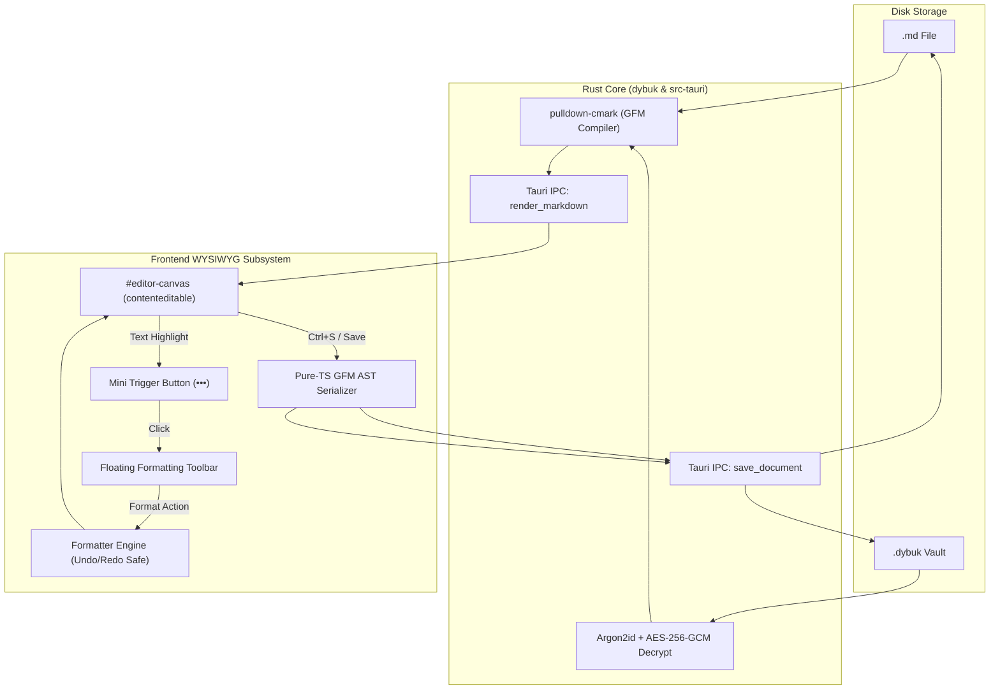

# Floating Toolbar & WYSIWYG Markdown Editing Architecture

This document describes the design, mechanics, and data flow of Dybuk's **Zero-Dependency WYSIWYG Editor** and its **Two-Stage Floating Formatting Toolbar**.

---

## 1. Design Philosophy

Dybuk is designed for writers who want the portability and permanence of standard Markdown without the visual friction of raw syntax (`#`, `**`, `~~`, `` ` ``).

- **Zero Syntax in the Canvas**: When opened, documents are compiled into semantic HTML. Users interact with styled typography, real tables, clickable task checkboxes, and formatted code blocks.
- **Distraction-Free Interaction**: The editor canvas has no static, heavy ribbon or toolbar pinned to the window. Formatting controls appear only when text is highlighted.
- **Deterministic Disk Persistence**: On save, the live DOM tree is serialized back into clean, standardized GitHub-Flavored Markdown (GFM) before writing to `.md` files or sealing into encrypted `.dybuk` vaults.

---

## 2. System Architecture & Data Flow



---

## 3. Two-Stage Floating Toolbar UX

The floating formatting system operates in two progressive stages to minimize visual distraction while providing immediate formatting capabilities:

```
[The quick brown fox] ❲•••❳  <── Stage 1: Mini Trigger (Selection End)
         │
         ▼ (Click Trigger)
┌───────────────────────────────────────────────────────────┐
│  B   I   S   ` `  🔗  ⌫  │  H ▾  │  •   1.  ☑   "  ```  ── │  <── Stage 2: Expanded Toolbar
└───────────────────────────────────────────────────────────┘
```

### Stage 1: Selection Detection & Mini Trigger (`•••`)
1. The toolbar listens to `selectionchange`, `mouseup`, and `keyup` events across the document.
2. If a non-collapsed selection is made within `#editor-canvas`:
   - The selection's bounding box is calculated via `range.getBoundingClientRect()`.
   - A compact pill button (`#floating-trigger`) containing a vector `•••` icon is positioned near the end of the selection.
   - Trigger coordinates are clamped within the viewport boundaries to prevent clipping.

### Stage 2: Expanded Bubble Toolbar Menu
1. Clicking the mini trigger expands the full floating toolbar (`#floating-toolbar`).
2. The toolbar is positioned centered directly above the selection.
3. The editor inspects the active DOM node tree (`getActiveFormatState`) and synchronizes active button highlights and dropdown labels (e.g. `H1`, `H2`, `B`, `I`, `List`).

### Selection Loss Prevention
A critical challenge in WYSIWYG editors is that clicking toolbar buttons can cause the browser to shift focus away from the canvas, collapsing the text selection before the command runs.

Dybuk solves this by:
- Intercepting `mousedown` on toolbar buttons with `e.preventDefault()`.
- Caching the active `Range` on selection change (`savedRange = range.cloneRange()`).
- Explicitly calling `restoreSelection()` prior to executing any formatting command.

---

## 4. Formatting Engine (`formatter.ts`)

The formatting engine provides inline and block-level transformations while preserving the browser's native Undo/Redo stack (<kbd>Ctrl+Z</kbd> / <kbd>Ctrl+Y</kbd>):

| Tool | Action | Shortcut | Output Element |
| :--- | :--- | :--- | :--- |
| **Bold** | `toggleBold()` | <kbd>Ctrl+B</kbd> | `<strong>...</strong>` |
| **Italic** | `toggleItalic()` | <kbd>Ctrl+I</kbd> | `<em>...</em>` |
| **Strikethrough** | `toggleStrikethrough()` | <kbd>Ctrl+Shift+X</kbd> | `<del>...</del>` |
| **Inline Code** | `toggleInlineCode()` | <kbd>Ctrl+`</kbd> | `<code>...</code>` |
| **Link** | `applyLink(url)` | <kbd>Ctrl+K</kbd> | `<a href="...">...</a>` |
| **LaTeX Math** | `applyMath(tex, isDisplay)` | <kbd>Ctrl+M</kbd> | `<span class="math math-inline" data-tex="...">` / `div.math.math-display` |
| **Clear Format** | `clearFormatting()` | — | Removes inline formatting tags |
| **Headings** | `applyHeading(level)` | — | `<h1>` through `<h6>` |
| **Bullet List** | `toggleBulletList()` | — | `<ul><li>...</li></ul>` |
| **Numbered List**| `toggleNumberedList()` | — | `<ol><li>...</li></ol>` |
| **Task List** | `toggleTaskList()` | — | `<ul class="contains-task-list"><li class="task-list-item"><input type="checkbox"> ...</li></ul>` |
| **Blockquote** | `toggleBlockquote()` | — | `<blockquote>...</blockquote>` |
| **Code Block** | `insertCodeBlock(lang)` | — | `<pre><code class="language-...">...</code></pre>` |
| **Horizontal Rule** | `insertHorizontalRule()` | — | `<hr>` |

### Link & LaTeX Math Popover Workflows
- **Link Popover (`#toolbar-link-popover`)**: Automatically extracts and pre-populates existing URLs when selection is inside an `<a>` tag. Pressing <kbd>Enter</kbd> applies the link with secure target/rel attributes.
- **LaTeX Math Popover (`#toolbar-math-popover`)**: Opens via the math button (<kbd>Ctrl+M</kbd>) or by clicking any rendered formula in the canvas. Features **live KaTeX preview**, display mode toggle (`$$`), and serialization to `$formula$` / `$$formula$$`.

---

## 5. Bidirectional Serialization Pipeline

```
Markdown Source ──► [pulldown-cmark (Rust)] ──► Semantic HTML ──► [Canvas DOM]
                                                                        │
Clean GFM ◄──────── [domToMarkdown (TS)] ◄──────────────────────────────┘
```

### 1. Markdown to DOM (`markdownToDom`)
- When opening a document, the raw Markdown string is sent via Tauri IPC to Rust core (`dybuk::render_to_html`).
- The `pulldown-cmark` parser compiles the markdown into structured HTML with GFM extensions:
  - Tables (`ENABLE_TABLES`)
  - Footnotes (`ENABLE_FOOTNOTES`)
  - Strikethrough (`ENABLE_STRIKETHROUGH`)
  - Tasklists (`ENABLE_TASKLISTS`)
  - Smart Punctuation (`ENABLE_SMART_PUNCTUATION`)
  - Math (`ENABLE_MATH`)
- Tasklist checkboxes are post-processed on mount to remove `disabled` attributes, enabling interactive toggling inside the live canvas.

### 2. DOM to Markdown (`domToMarkdown`)
- Upon saving, `domToMarkdown` recursively traverses the contenteditable DOM tree and transforms HTML AST nodes into standardized GFM:
  - `H1`–`H6` $\rightarrow$ `# ` to `###### `
  - `STRONG` / `B` $\rightarrow$ `**text**`
  - `EM` / `I` $\rightarrow$ `*text*`
  - `DEL` / `S` $\rightarrow$ `~~text~~`
  - `CODE` $\rightarrow$ `` `code` ``
  - `PRE > CODE` $\rightarrow$ ```` ```lang\ncode\n``` ````
  - `BLOCKQUOTE` $\rightarrow$ `> line`
  - `UL` / `OL` / `LI` $\rightarrow$ `- item`, `1. item`, `- [x] task` (with nesting indentation)
  - `TABLE` $\rightarrow$ GFM pipe table (`| col1 | col2 |`) with column alignment indicators
  - `A` / `IMG` $\rightarrow$ `[text](url)` / ``
  - `HR` $\rightarrow$ `---`
- Consecutive whitespace and multiple blank lines are normalized to standard two-newline paragraph separation.

---

## 6. Typography & GitHub Dark Styling

The canvas styling is unified with GitHub Dark styling tokens:

- **Prose / Body**: Literata (`--editor-font-family`), font size `15px`, line-height `1.55`, paragraph bottom margin `8px`.
- **Code & Syntax**: Kode Mono (`--mono-font-family`) with `#161b22` block background and `#30363d` borders.
- **Headings**: Open Sans (`--font-family`) with `#3d444db3` bottom dividing borders on `H1` and `H2`.
- **Tables & Blockquotes**: Full GFM borders, zebra row backgrounds (`#151b23` / `#0d1117`), and `#3d444d` quote borders.

