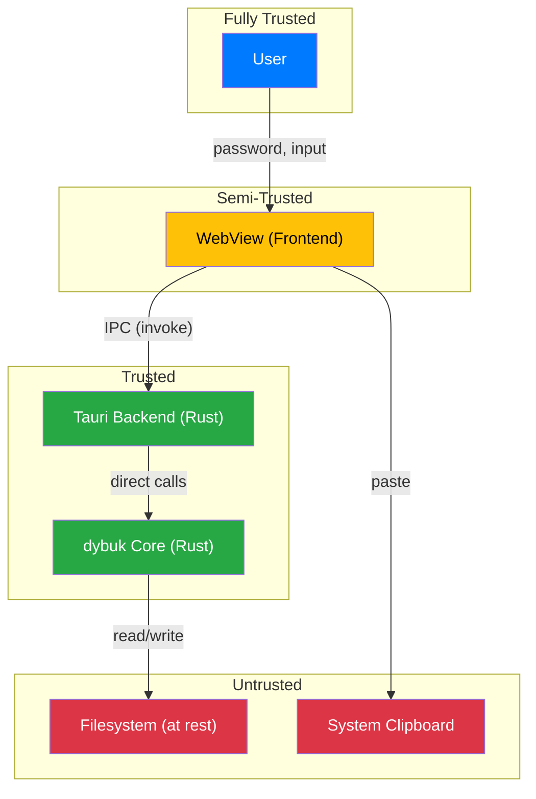

# Threat Model

**Last Updated**: 2026-08-24

This document defines what Dybuk protects against, what it does not, the trust boundaries within the system, and the specific mitigations implemented at each layer. It is intended for security reviewers, contributors adding new features, and users evaluating whether Dybuk's guarantees match their risk profile.

---

## Scope

Dybuk is a **local-first, single-user, offline markdown editor** with optional file-level encryption. Its security objective is narrow and specific:

> **Protect the contents of `.dybuk` files against unauthorized access when the file is at rest on disk, assuming the user's password has not been compromised.**

Dybuk is not a general-purpose security tool. It does not protect against all categories of attacks. The sections below make the boundaries explicit.

---

## Assets

These are the things worth protecting in the Dybuk system:

| Asset | Location | Sensitivity |
|:---|:---|:---|
| **Plaintext document content** | In-memory (during editing) | High — this is the user's private writing. |
| **Derived encryption key** | In-memory (ephemeral, during seal/unseal) | Critical — allows decryption of the vault file. |
| **User password** | In-memory (ephemeral, during input and KDF) | Critical — the root secret from which the key is derived. |
| **`.dybuk` vault files** | On disk | Protected by encryption. Confidentiality depends on password strength and KDF parameters. |
| **`.md` files** | On disk | Unprotected. Stored as plaintext GFM. No confidentiality guarantee. |
| **User settings** | On disk (config file) | Low — contains preferences (theme, font size), no secrets. |

---

## Threat Actors

Dybuk's threat model considers the following actors, ordered by increasing capability:

### 1. Curious Bystander

**Profile**: Someone with brief, unsupervised physical access to the user's unlocked device (e.g., a roommate, colleague, family member).

**Capability**: Can browse the filesystem, open files, and read file contents. Cannot install software, run forensic tools, or extract memory dumps.

**Dybuk's defense**: `.dybuk` files are encrypted at rest. The bystander cannot read the file contents without the password. `.md` files are not protected — they are readable in any text editor.

### 2. Stolen/Lost Device

**Profile**: An attacker who gains permanent physical possession of the device (e.g., theft, loss, device disposal without wiping).

**Capability**: Full access to the filesystem. Can clone the disk, run brute-force attacks offline, and use forensic recovery tools.

**Dybuk's defense**: `.dybuk` files are encrypted with AES-256-GCM. The key is derived from the password via Argon2id (m=19 MiB, t=2, p=1), which imposes a computational cost on each brute-force attempt. The strength of this defense is **entirely dependent on the user's password quality**. A weak password (e.g., `password123`) will fall to dictionary attacks regardless of the KDF parameters.

### 3. Malware on the Host

**Profile**: Malicious software running on the user's device with the same privileges as the user's session (e.g., a trojan, spyware, or malicious browser extension).

**Capability**: Can read process memory, intercept keyboard input (keylogger), capture screenshots, and access any file the user can access.

**Dybuk's defense**: **Limited.** Once the document is decrypted and loaded into memory for editing, malware running with the user's privileges can read the plaintext from process memory. Dybuk mitigates key material exposure by zeroizing derived keys and password buffers immediately after use (via the `zeroize` crate), but it cannot protect plaintext that is actively being displayed in the editor. This threat is **out of scope** for Dybuk — it requires OS-level defenses (antivirus, sandboxing, endpoint detection).

### 4. Targeted Forensics

**Profile**: A sophisticated attacker (law enforcement, state actor, corporate security) with full disk access, forensic tools, and potentially access to memory dumps or hibernation files.

**Capability**: Can perform cold boot attacks, analyze swap files and hibernation images for key material, use advanced disk recovery to find deleted files, and apply computational resources to brute-force passwords.

**Dybuk's defense**: **Minimal beyond encryption at rest.** Dybuk zeroizes key material in heap memory, but cannot control swap, hibernation files, or OS-level memory management. If the OS pages the application's memory to disk, key material or plaintext may be recoverable. Full-disk encryption (BitLocker, FileVault, LUKS) is the user's defense against this actor.

---

## Trust Boundaries

### Boundary 1: User ↔ Application

The user is the sole trusted party. Dybuk assumes the user is who they claim to be if they know the password. There is no secondary authentication (biometrics, 2FA) in version 1.

### Boundary 2: Frontend (WebView) ↔ Backend (Rust)

The WebView is treated as **semi-trusted**. It runs in the OS's native webview engine and is subject to the same vulnerability classes as any web content (XSS, injection). Tauri v2's capabilities system enforces the boundary:

- The frontend cannot access the filesystem directly. All file operations go through IPC commands.
- The frontend cannot make network requests. No `http:` or `websocket:` capabilities are granted.
- The frontend cannot execute shell commands. No `shell:` capabilities are granted.
- Each IPC command is explicitly registered and scoped.

**Attack scenario**: If an attacker injects JavaScript into the webview (e.g., via a crafted markdown file with embedded scripts), the injected code can only call the IPC commands that are registered and permitted. It cannot read arbitrary files, exfiltrate data over the network, or execute system commands because those capabilities are not granted.

### Boundary 3: Application ↔ Filesystem

The filesystem is untrusted. Files on disk may be:

- Modified by other programs while Dybuk is running (file integrity is not monitored after load).
- Replaced with crafted malicious files designed to exploit header parsing.
- Located on shared storage (network drives, USB drives) accessible to other parties.

Dybuk defends against malicious files through strict header validation (magic bytes, version, KDF parameter ranges, minimum file size) before attempting any cryptographic operation.

### Boundary 4: Application ↔ Clipboard

The system clipboard is untrusted and shared across all applications. When the user copies text from the editor, the plaintext is placed on the clipboard where any other application can read it. Dybuk does not automatically clear the clipboard after copy operations (this is a potential future mitigation).

---

## Attack Surface Analysis

### IPC Bridge (Tauri)

| Attack Vector | Risk | Mitigation |
|:---|:---|:---|
| Injected JavaScript calling IPC commands | Medium | Tauri capabilities restrict which commands are callable. Commands are scoped to user-initiated file dialogs. |
| Malformed IPC arguments | Low | All IPC payloads are deserialized by `serde` with strict type definitions. Invalid types are rejected at the deserialization boundary. |
| Command injection via file paths | Low | File paths are passed to Rust's `std::fs` API, which handles path traversal safely. No shell interpolation occurs. |

### File System Access

| Attack Vector | Risk | Mitigation |
|:---|:---|:---|
| Crafted `.dybuk` file with malicious header | Medium | Strict header validation: magic bytes, version range, KDF parameter bounds. Invalid headers are rejected before any crypto operation. |
| Extremely large `kdf_memory` value (DoS) | Medium | KDF memory parameter is capped at 4 GiB. Values above the cap are rejected. |
| Path traversal in file open/save | Low | Tauri's file dialog returns absolute paths controlled by the OS. User-typed paths (if supported) are resolved and validated. |

### Memory

| Attack Vector | Risk | Mitigation |
|:---|:---|:---|
| Key material lingering in heap after use | Medium | `zeroize` crate overwrites key, password, and plaintext buffers on all code paths (including error paths). |
| Key material in stack frames after function return | Low | Rust's ownership model and `Drop` trait integration with `zeroize` handle stack cleanup. |
| Key material in OS swap/page file | High (if attacker has disk access) | Out of scope. Users concerned about this should enable full-disk encryption and disable swap/hibernation. |

### Cryptographic

| Attack Vector | Risk | Mitigation |
|:---|:---|:---|
| Brute-force password attack on `.dybuk` file | Depends on password | Argon2id with m=19 MiB, t=2, p=1 imposes ~250ms per attempt on modern hardware. A 12-character random password is infeasible to brute-force. A 4-character PIN is not. |
| Nonce reuse (AES-256-GCM catastrophic failure) | Negligible | Fresh 32-byte salt and 12-byte nonce generated from CSPRNG on every seal operation. Probability of collision: ~2^-352. |
| Side-channel attacks on Argon2id | Low | Argon2id (the hybrid variant) is specifically designed to resist side-channel attacks (unlike Argon2i or Argon2d alone). |
| Downgrade attack on KDF parameters | None | KDF parameters are included in the AAD for AES-256-GCM. Modifying them invalidates the auth tag. |

---

## Mitigations Summary

| Mitigation | Implementation | Documented In |
|:---|:---|:---|
| AES-256-GCM authenticated encryption | `dybuk::crypto::aead` | [FILE_FORMAT.md](./FILE_FORMAT.md) |
| Argon2id key derivation | `dybuk::crypto::kdf` | [FILE_FORMAT.md](./FILE_FORMAT.md) |
| Header fields as AAD | `dybuk::vault::seal` / `unseal` | [FILE_FORMAT.md](./FILE_FORMAT.md) |
| Key/password/plaintext zeroization | `dybuk::crypto::wipe` via `zeroize` crate | [ARCHITECTURE.md](./ARCHITECTURE.md) |
| Tauri capabilities (least privilege) | `desktop/src-tauri/capabilities/` | [ARCHITECTURE.md](./ARCHITECTURE.md) |
| No network access | No `http:` or `websocket:` capabilities granted | [ARCHITECTURE.md](./ARCHITECTURE.md) |
| No shell access | No `shell:` capabilities granted | [ARCHITECTURE.md](./ARCHITECTURE.md) |
| Strict header validation | `dybuk::vault::integrity` | [FILE_FORMAT.md](./FILE_FORMAT.md) |
| Opaque error messages | `DecryptionFailed` never reveals why | [FILE_FORMAT.md](./FILE_FORMAT.md) |
| Pure-Rust crypto (no C/asm deps) | RustCrypto crate family | [ARCHITECTURE.md](./ARCHITECTURE.md) |

---

## Out-of-Scope Threats

These threats are explicitly **not addressed** by Dybuk. Users facing these threats need additional, external defenses.

| Threat | Why It's Out of Scope | User's Defense |
|:---|:---|:---|
| **Keylogger** | A keylogger captures the password as the user types it. Dybuk cannot prevent this. | OS-level antivirus, endpoint detection, hardware security keys (not supported by Dybuk). |
| **Screen capture / shoulder surfing** | The decrypted content is displayed on screen. Any screen recorder or observer can read it. | Privacy screens, secure environments, awareness. |
| **Rubber-hose cryptanalysis** | Physical coercion to reveal the password. No software defense exists. | Legal protections, operational security. |
| **Compromised OS kernel** | A rootkit or compromised kernel can read any process's memory and intercept all I/O. | Trusted boot, secure hardware (TPM), OS reinstallation. |
| **Compromised Rust toolchain** | A supply-chain attack on the Rust compiler or crate registry could inject backdoors. | Reproducible builds, dependency auditing (`cargo audit`), vendored dependencies. |
| **Electromagnetic side channels** | TEMPEST-class attacks that read screen contents or keyboard input via electromagnetic emissions. | Shielded hardware, SCIF environments. |
| **Weak passwords** | A 4-character password is trivially brute-forced regardless of KDF parameters. | Password managers, user education. Dybuk may add a password strength indicator in the UI, but it cannot enforce password policy. |
| **Unencrypted `.md` files** | Plain `.md` files have zero confidentiality protection. | Users should save sensitive content as `.dybuk`, not `.md`. Dybuk may add a reminder/warning in the UI. |

---

## Password Strength Guidance

Dybuk's encryption is only as strong as the user's password. For reference:

| Password Type | Entropy (approx.) | Brute-Force Time (Argon2id, single GPU) |
|:---|:---|:---|
| 4-digit PIN | ~13 bits | Seconds |
| 6-character lowercase | ~28 bits | Hours |
| 8-character mixed case + digits | ~48 bits | Years |
| 12-character mixed + symbols | ~72 bits | Infeasible (heat death of the universe) |
| 4-word passphrase (Diceware) | ~51 bits | Decades |
| 6-word passphrase (Diceware) | ~77 bits | Infeasible |

The user interface should communicate this guidance when the user creates a new `.dybuk` file. See [UX.md](./UX.md) for the password dialog specification.

---

## Responsible Disclosure

If you discover a security vulnerability in Dybuk, please follow the process described in [SECURITY.md](../SECURITY.md):

- **Do not** open a public issue.
- Report privately to the maintainers with reproduction steps and impact assessment.
- Allow time for a fix before public disclosure.
