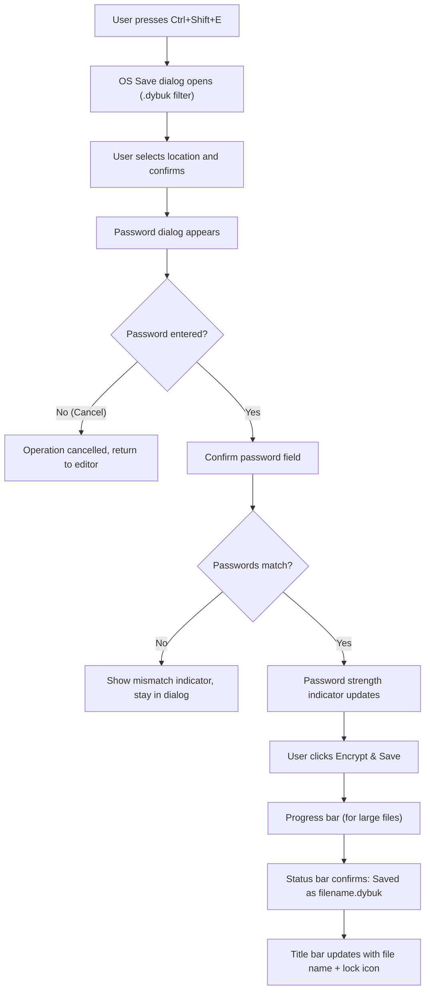
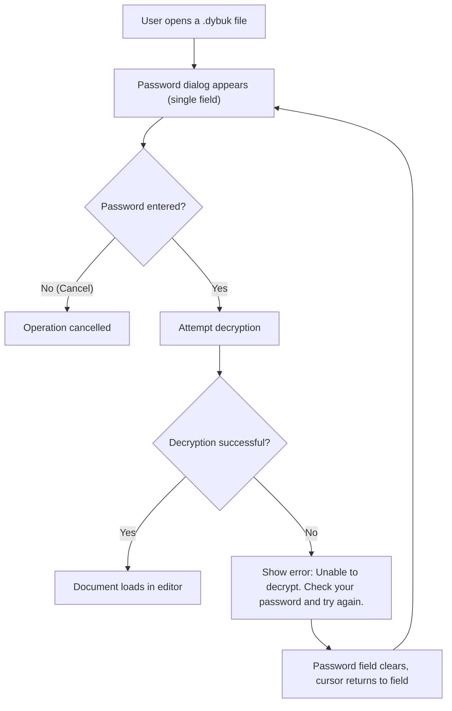

# UX Specification

**Last Updated**: 2026-08-24

This document defines the interaction design, layout anatomy, keyboard mappings, vault workflow, typography, and accessibility requirements for Dybuk. It is the authoritative reference for anyone implementing or reviewing the user interface on any platform (desktop or mobile).

---

## Design Philosophy

Dybuk follows a single design principle:

> **The tool disappears. The writer sees only the page and the words.**

This means:

1. **Canvas-first.** The editor canvas occupies nearly all of the screen. There are no permanent sidebars, tab bars, or status panels. Auxiliary UI (toolbar, status bar) is present but recedes when the user is actively typing.
2. **Keyboard-centric.** Every formatting action has a keyboard shortcut. The mouse/touch is optional — a writer should never need to leave the keyboard to format text.
3. **Progressive disclosure.** Features exist but stay hidden until invoked. The toolbar appears on hover or shortcut. The status bar fades when the user types. Settings live behind a single gear icon. The first impression is an empty page, not a control panel.
4. **Quiet stability.** No notification banners. No sync spinners. No update popups. The application saves reliably and silently. If something fails, it communicates with a brief, non-modal status message — never with a blocking dialog unless user input is required (e.g., password entry).

---

## Layout Anatomy

### Desktop Layout

```
┌─────────────────────────────────────────────────────────────┐
│  Title Bar (OS-native)                              [—][□][×]│
├─────────────────────────────────────────────────────────────┤
│                                                             │
│                                                             │
│                                                             │
│                    ┌───────────────────┐                     │
│                    │                   │                     │
│                    │   Editor Canvas   │                     │
│                    │                   │                     │
│                    │   (centered,      │                     │
│                    │    max-width)      │                     │
│                    │                   │                     │
│                    └───────────────────┘                     │
│                                                             │
│                                                             │
│          ┌────────────────────────────────┐                  │
│          │  Floating Toolbar (on hover)   │                  │
│          └────────────────────────────────┘                  │
│                                                             │
├─────────────────────────────────────────────────────────────┤
│  Status Bar: [file name] · [word count] · [line:col]  [⚙]  │
└─────────────────────────────────────────────────────────────┘
```

#### Editor Canvas

- Occupies the full window width and height, minus the title bar and status bar.
- Content is horizontally centered with a maximum width of **720px** (configurable via settings). This constrains line length for comfortable reading, similar to a printed page.
- Vertical padding: **48px** top, **120px** bottom (extra bottom padding so the cursor is never at the very bottom of the screen).
- Background color fills the full window behind the canvas, creating a seamless surface.

#### Floating Toolbar

- Positioned at the bottom-center of the canvas, floating above the content.
- **Visibility**: hidden by default. Appears when the user:
  - Moves the mouse into the lower 20% of the window, OR
  - Presses `Ctrl+/` (toggle), OR
  - Selects text (auto-appears near the selection).
- Fades out with a 200ms ease-out transition after the mouse leaves or 3 seconds of keyboard inactivity.
- Contains formatting buttons (see Toolbar Buttons below).
- Semi-transparent background with a subtle blur effect (frosted glass aesthetic).

#### Status Bar

- Fixed at the bottom of the window. Height: **32px**.
- Displays (left to right):
  - File name (or "Untitled" for new documents). Includes a lock icon if the file is `.dybuk`.
  - Word count.
  - Line and column number of the cursor (`Ln 42, Col 17`).
- Right side: settings gear icon (opens settings panel).
- **Fade behavior**: the status bar reduces opacity to 30% after 5 seconds of keyboard activity (the user is typing and doesn't need status info). Opacity returns to 100% on mouse movement or keyboard inactivity.

### Mobile Layout

- The editor canvas fills the full screen. No status bar is shown during active typing — it conflicts with the virtual keyboard.
- The floating toolbar sits **above the virtual keyboard** when the keyboard is open.
- A top-right menu button (three-dot or hamburger) provides access to: Open, Save, Save as .dybuk, Settings.
- File name and lock icon are shown in the top navigation bar.
- Word count and cursor position are accessible via a swipe-up gesture on the status area or through the menu.

---

## Interaction Patterns

### WYSIWYG Inline Rendering

Dybuk renders GFM inline — formatting is applied as the user types, without showing raw markdown syntax. The experience is similar to Typora's "live preview" mode.

| User Action | What Happens | What the User Sees |
|:---|:---|:---|
| Types `#` then space at start of line | Line becomes an H1 heading | Large, bold text. The `# ` prefix is hidden. |
| Presses `Ctrl+B` with text selected | Wraps selection in `**...**` | Selected text becomes bold. Asterisks are hidden. |
| Types `` ` `` around a word | Word becomes inline code | Monospaced text with a subtle background. Backticks are hidden. |
| Presses `Enter` twice | Inserts a paragraph break | Visual spacing between paragraphs. |
| Types `- ` at start of line | Line becomes an unordered list item | Bullet point appears. Dash is replaced with a dot. |
| Types `1. ` at start of line | Line becomes an ordered list item | Number appears with proper formatting. |
| Types `> ` at start of line | Line becomes a blockquote | Indented text with a left border. |
| Types `` ``` `` on a new line | Opens a fenced code block | Monospaced block with a distinct background. |

**Editing rendered elements**: Clicking on a rendered element (e.g., a bold word) places the cursor inside it and briefly reveals the underlying markdown syntax for editing. This allows power users to make precise changes without needing a separate "source mode."

### Focus Mode

An optional mode that dims all content except the current paragraph. Everything above and below the active paragraph drops to 30% opacity. This narrows the writer's attention to the immediate work.

- **Activation**: `Ctrl+Shift+F` or via the settings panel.
- **Behavior**: As the cursor moves between paragraphs, the opacity transition follows with a 150ms ease animation.
- **Interaction with toolbar**: The toolbar remains fully opaque in focus mode.

### Typewriter Mode

An optional mode that keeps the active line vertically centered in the viewport at all times. As the writer types and creates new lines, the content scrolls up so the cursor never drifts to the bottom of the screen.

- **Activation**: `Ctrl+Shift+T` or via the settings panel.
- **Behavior**: Smooth scroll animation (200ms ease) keeps the cursor line at the vertical center (or slightly above center, at the 40% mark).
- **Combined with Focus Mode**: Both modes can be active simultaneously.

---

## Keyboard Shortcuts

All shortcuts use `Ctrl` on Windows/Linux and `Cmd` on macOS. The table below uses `Ctrl` as the modifier — substitute `Cmd` for macOS.

### File Operations

| Shortcut | Action |
|:---|:---|
| `Ctrl+N` | New document |
| `Ctrl+O` | Open file (OS file dialog) |
| `Ctrl+S` | Save file (to current path and format) |
| `Ctrl+Shift+S` | Save As (OS file dialog, `.md`) |
| `Ctrl+Shift+E` | Save as `.dybuk` (password dialog) |
| `Ctrl+W` | Close document (prompts to save if modified) |

### Text Formatting

| Shortcut | Action | GFM Equivalent |
|:---|:---|:---|
| `Ctrl+B` | Toggle bold | `**text**` |
| `Ctrl+I` | Toggle italic | `*text*` |
| `Ctrl+Shift+X` | Toggle strikethrough | `~~text~~` |
| `Ctrl+\`` | Toggle inline code | `` `text` `` |
| `Ctrl+K` | Insert/edit link | `[text](url)` |

### Block Formatting

| Shortcut | Action | GFM Equivalent |
|:---|:---|:---|
| `Ctrl+1` through `Ctrl+6` | Set heading level 1–6 | `# ` through `###### ` |
| `Ctrl+0` | Remove heading (paragraph) | Plain text |
| `Ctrl+Shift+U` | Toggle unordered list | `- ` prefix |
| `Ctrl+Shift+O` | Toggle ordered list | `1. ` prefix |
| `Ctrl+Shift+Q` | Toggle blockquote | `> ` prefix |
| `Ctrl+Shift+C` | Toggle fenced code block | ` ``` ` fence |
| `Ctrl+Shift+H` | Insert horizontal rule | `---` |

### Editor Behavior

| Shortcut | Action |
|:---|:---|
| `Ctrl+Z` | Undo |
| `Ctrl+Y` or `Ctrl+Shift+Z` | Redo |
| `Ctrl+A` | Select all |
| `Ctrl+/` | Toggle toolbar visibility |
| `Ctrl+Shift+F` | Toggle focus mode |
| `Ctrl+Shift+T` | Toggle typewriter mode |
| `Ctrl+,` | Open settings panel |
| `F11` | Toggle full screen |

---

## Toolbar Buttons

The floating toolbar contains the following buttons, arranged left to right. Each button is a minimal SVG icon (no emoji, no text labels). Tooltips appear on hover showing the action name and shortcut.

| Button | Icon Description | Action | Shortcut Shown in Tooltip |
|:---|:---|:---|:---|
| **Bold** | Letter "B" in bold weight | Toggle bold | `Ctrl+B` |
| **Italic** | Letter "I" in italic style | Toggle italic | `Ctrl+I` |
| **Strikethrough** | Letter "S" with a horizontal line through it | Toggle strikethrough | `Ctrl+Shift+X` |
| **Code** | Angle brackets `</>` | Toggle inline code | ``Ctrl+` `` |
| **Link** | Chain link icon | Insert/edit link | `Ctrl+K` |
| (separator) | | | |
| **Heading** | Letter "H" with a dropdown chevron | Dropdown: H1–H6 | `Ctrl+1` through `Ctrl+6` |
| **Unordered List** | Three lines with bullet dots | Toggle unordered list | `Ctrl+Shift+U` |
| **Ordered List** | Three lines with numbers | Toggle ordered list | `Ctrl+Shift+O` |
| **Blockquote** | Opening quotation mark | Toggle blockquote | `Ctrl+Shift+Q` |
| **Code Block** | Rectangle with angle brackets inside | Toggle fenced code block | `Ctrl+Shift+C` |
| (separator) | | | |
| **Horizontal Rule** | Horizontal line icon | Insert horizontal rule | `Ctrl+Shift+H` |

---

## Vault Workflow

### Save as `.dybuk` (First-Time Encryption)



**Password Dialog Design**:

- **Modal overlay** with a frosted-glass backdrop dimming the editor canvas.
- **Two fields**: "Password" and "Confirm Password". Both use a monospaced font to help the user verify character-by-character.
- **Show/hide toggle**: An eye icon on each field to toggle password visibility.
- **Password strength indicator**: A horizontal bar below the password field that fills and changes color based on entropy estimation:
  - Red (weak): < 28 bits
  - Orange (moderate): 28–48 bits
  - Green (strong): > 48 bits
  - A text label accompanies the bar: "Weak", "Moderate", "Strong".
- **Warning text** (always visible): "If you forget this password, the file cannot be recovered. There is no password reset."
- **Buttons**: "Cancel" (secondary) and "Encrypt & Save" (primary). The primary button is disabled until both passwords match and are non-empty.

### Open a `.dybuk` File



**Unlock Dialog Design**:

- Same modal overlay as the save dialog.
- **Single field**: "Password".
- **Show/hide toggle**: Eye icon.
- **Error state**: On failed decryption, the password field border flashes red (200ms), a shake animation plays on the dialog (a subtle 6px horizontal oscillation over 300ms), and the error message appears below the field.
- **No attempt counter**: The dialog does not lock out after N failed attempts. Rate-limiting is provided by the Argon2id computation time (~250ms per attempt), not by UI restrictions.
- **Buttons**: "Cancel" (secondary) and "Unlock" (primary).

### Re-saving an Already-Encrypted File

When the user presses `Ctrl+S` on a file that was opened from a `.dybuk` source:

- The file is re-encrypted with the **same password** that was used to open it.
- The password is **not** stored in memory between save operations. Instead, the user is prompted to re-enter it.
- A fresh salt and nonce are generated for every save operation (as specified in [FILE_FORMAT.md](./FILE_FORMAT.md)).

**Rationale for re-prompting the password**: Keeping the password in memory between saves would be convenient but increases the window of exposure to memory-scraping attacks. The UX tradeoff is acceptable because saves are infrequent relative to the time spent writing.

---

## Typography & Color

### Font Stack

| Context | Font | Fallback | Source |
|:---|:---|:---|:---|
| **UI elements** (toolbar, status bar, settings, dialogs) | Inter | system-ui, -apple-system, sans-serif | Google Fonts |
| **Editor canvas** (body text) | Inter | system-ui, -apple-system, sans-serif | Google Fonts |
| **Monospace** (code blocks, inline code) | JetBrains Mono | Consolas, monospace | Google Fonts |
| **Headings** (H1–H6 in editor) | Inter (weight 700) | system-ui bold | Google Fonts |

Font files are bundled with the application (not loaded from a CDN) to ensure offline-only operation.

### Color Palette

Dybuk ships with a dark theme as the default and a light theme as an alternative. Both themes use a carefully tuned palette designed to reduce eye strain during long writing sessions.

#### Dark Theme (Default)

| Token | HSL | Hex | Usage |
|:---|:---|:---|:---|
| `--bg-primary` | `hsl(220, 16%, 10%)` | `#161920` | Window background |
| `--bg-canvas` | `hsl(220, 14%, 12%)` | `#1B1E25` | Editor canvas background |
| `--bg-surface` | `hsl(220, 14%, 16%)` | `#24272F` | Toolbar, dialogs, settings panel |
| `--bg-hover` | `hsl(220, 14%, 20%)` | `#2D313A` | Button hover state |
| `--text-primary` | `hsl(220, 10%, 88%)` | `#DDE0E6` | Body text, headings |
| `--text-secondary` | `hsl(220, 8%, 55%)` | `#858A94` | Status bar, labels, placeholders |
| `--text-muted` | `hsl(220, 6%, 35%)` | `#535760` | Dimmed text in focus mode |
| `--accent` | `hsl(210, 65%, 55%)` | `#3B8ED6` | Links, active toolbar button, primary button bg |
| `--accent-hover` | `hsl(210, 65%, 62%)` | `#5CA1DE` | Accent hover state |
| `--border` | `hsl(220, 10%, 20%)` | `#2F3239` | Subtle borders, separators |
| `--error` | `hsl(0, 65%, 55%)` | `#D63B3B` | Error messages, password mismatch |
| `--warning` | `hsl(35, 80%, 55%)` | `#E09520` | Password strength "moderate" |
| `--success` | `hsl(140, 50%, 45%)` | `#39B366` | Password strength "strong", save confirmation |
| `--code-bg` | `hsl(220, 14%, 14%)` | `#1F222A` | Inline code and code block background |

#### Light Theme

| Token | HSL | Hex | Usage |
|:---|:---|:---|:---|
| `--bg-primary` | `hsl(220, 16%, 96%)` | `#F2F3F6` | Window background |
| `--bg-canvas` | `hsl(0, 0%, 100%)` | `#FFFFFF` | Editor canvas background |
| `--bg-surface` | `hsl(220, 14%, 94%)` | `#ECEEF2` | Toolbar, dialogs, settings panel |
| `--bg-hover` | `hsl(220, 14%, 90%)` | `#E1E3E9` | Button hover state |
| `--text-primary` | `hsl(220, 16%, 16%)` | `#222730` | Body text, headings |
| `--text-secondary` | `hsl(220, 8%, 45%)` | `#6A6F78` | Status bar, labels, placeholders |
| `--text-muted` | `hsl(220, 6%, 70%)` | `#ADAFB4` | Dimmed text in focus mode |
| `--accent` | `hsl(210, 65%, 45%)` | `#2872B8` | Links, active toolbar button |
| `--accent-hover` | `hsl(210, 65%, 38%)` | `#21619D` | Accent hover state |
| `--border` | `hsl(220, 10%, 86%)` | `#D8DAE0` | Subtle borders, separators |
| `--error` | `hsl(0, 65%, 45%)` | `#BE2828` | Error messages |
| `--warning` | `hsl(35, 80%, 42%)` | `#C17A0A` | Password strength "moderate" |
| `--success` | `hsl(140, 50%, 35%)` | `#2D8F52` | Password strength "strong" |
| `--code-bg` | `hsl(220, 14%, 94%)` | `#ECEEF2` | Inline code and code block background |

### Typography Scale

All sizes are in `rem` units (base: `16px`).

| Element | Size | Weight | Line Height |
|:---|:---|:---|:---|
| Body text | `1.0rem` (16px) | 400 | 1.75 |
| H1 | `2.0rem` (32px) | 700 | 1.3 |
| H2 | `1.625rem` (26px) | 700 | 1.35 |
| H3 | `1.375rem` (22px) | 600 | 1.4 |
| H4 | `1.125rem` (18px) | 600 | 1.45 |
| H5 | `1.0rem` (16px) | 600 | 1.5 |
| H6 | `0.875rem` (14px) | 600 | 1.5 |
| Inline code | `0.875rem` (14px) | 400 | inherit |
| Code block | `0.875rem` (14px) | 400 | 1.6 |
| Status bar | `0.75rem` (12px) | 400 | 1.0 |
| Toolbar tooltip | `0.75rem` (12px) | 400 | 1.2 |

### Spacing

- **Canvas max-width**: `720px` (configurable: 600, 720, 840, 960).
- **Canvas horizontal padding**: `24px` (so text doesn't touch the edge at narrow widths).
- **Paragraph spacing**: `1.0em` margin-bottom between block elements.
- **List indentation**: `24px` per nesting level.
- **Blockquote left border**: `3px` solid `--accent`, with `16px` left padding.

---

## Responsiveness

### Desktop

- **Minimum window size**: `640 x 480` pixels.
- The canvas centers itself horizontally. At wide window sizes, the background fills the sides. At narrow sizes (below `canvas max-width + 2 * padding`), the canvas stretches to fill available width with padding preserved.
- The toolbar's position adapts: at very narrow widths, it spans the full width instead of floating.

### Mobile

- The canvas fills the full viewport width with `16px` horizontal padding.
- `canvas max-width` is ignored on mobile — full-width is always used.
- The floating toolbar repositions itself above the virtual keyboard when the keyboard is open. This requires platform-specific handling:
  - **Android**: Listen to `WindowInsets` changes for keyboard height.
  - **iOS**: Listen to `UIResponder.keyboardWillShowNotification` for keyboard frame.
- Font sizes may be scaled up slightly for touch readability (body text: `1.0625rem` / 17px).
- Touch targets for toolbar buttons: minimum `44 x 44` points (Apple HIG) / `48 x 48` dp (Material Design).

---

## Accessibility

### Keyboard Navigation

- All interactive elements (toolbar buttons, dialog fields, settings controls) are reachable via `Tab` / `Shift+Tab`.
- The toolbar traps focus when visible: `Tab` cycles through toolbar buttons, `Escape` dismisses the toolbar and returns focus to the editor.
- Dialogs trap focus: `Tab` cycles within the dialog, `Escape` cancels.

### Screen Reader Support

- The editor canvas uses `role="textbox"` with `aria-multiline="true"` and `aria-label="Document editor"`.
- Toolbar buttons use `aria-label` attributes describing the action (e.g., "Toggle bold, Ctrl+B").
- The status bar is a `role="status"` live region with `aria-live="polite"`.
- Dialogs use `role="dialog"` with `aria-labelledby` pointing to the dialog title.
- Error messages use `role="alert"` with `aria-live="assertive"`.

### Contrast Ratios

Both themes are designed to meet **WCAG 2.1 AA** contrast requirements:

- Body text on canvas background: minimum **7:1** ratio (exceeds AAA).
- Secondary text on canvas background: minimum **4.5:1** ratio (meets AA).
- Toolbar icons on toolbar background: minimum **4.5:1** ratio.
- Error text on surface background: minimum **4.5:1** ratio.

### Reduced Motion

If the user's OS has "reduce motion" enabled (`prefers-reduced-motion: reduce`):

- All transitions and animations are disabled (toolbar fade, focus mode opacity, typewriter scroll, dialog shake).
- Elements appear and disappear instantly instead of transitioning.

---

## Animations & Micro-Interactions

All durations and easings below are subject to the reduced-motion override above.

| Interaction | Animation | Duration | Easing |
|:---|:---|:---|:---|
| Toolbar appears | Fade in + slide up 8px | 200ms | ease-out |
| Toolbar disappears | Fade out + slide down 8px | 200ms | ease-out |
| Focus mode: paragraph dim | Opacity transition (100% → 30%) | 150ms | ease |
| Focus mode: paragraph highlight | Opacity transition (30% → 100%) | 150ms | ease |
| Typewriter mode: scroll to cursor | Smooth scroll | 200ms | ease |
| Password dialog: wrong password shake | Horizontal oscillation (±6px, 3 cycles) | 300ms | ease-in-out |
| Password strength bar: fill | Width + color transition | 200ms | ease |
| Status bar: fade on typing | Opacity transition (100% → 30%) | 400ms | ease |
| Status bar: fade on idle | Opacity transition (30% → 100%) | 200ms | ease |
| Save confirmation: status bar flash | Brief green tint on status bar background | 500ms | ease-out |
| File open: content load | Fade in from 0% to 100% opacity | 150ms | ease |

---

## Settings Panel

The settings panel opens as a slide-in overlay from the right edge of the window (320px wide, full height). It can be opened via the gear icon in the status bar or `Ctrl+,`.

### Available Settings

| Setting | Type | Default | Options |
|:---|:---|:---|:---|
| Theme | Dropdown | Dark | Dark, Light |
| Font Size | Slider | 16px | 12–24px (1px steps) |
| Canvas Width | Dropdown | 720px | 600, 720, 840, 960 |
| Line Height | Slider | 1.75 | 1.4–2.2 (0.05 steps) |
| Focus Mode | Toggle | Off | On / Off |
| Typewriter Mode | Toggle | Off | On / Off |
| Show Word Count | Toggle | On | On / Off |

Settings are persisted to a local JSON configuration file managed by the `dybuk::settings` module. Changes take effect immediately (live preview) — the user sees the effect on the editor canvas as they adjust the slider or toggle.

---

## Error & Edge Case Handling

| Scenario | UI Behavior |
|:---|:---|
| Open a non-`.md`, non-`.dybuk` file | Status bar shows: "Unsupported file format." No dialog, no modal. |
| Open a corrupted `.dybuk` file (bad header) | Error dialog: "This file is not a valid Dybuk vault or is corrupted." Single "OK" button. |
| Save fails (disk full, permission denied) | Error dialog: "Unable to save. [OS error message]." Buttons: "Retry" and "Save As" (to a different location). |
| Close with unsaved changes | Confirmation dialog: "You have unsaved changes. Save before closing?" Buttons: "Don't Save" (destructive), "Cancel", "Save" (primary). |
| File deleted externally while open | Status bar shows: "The file has been moved or deleted." The document remains in memory. Next save prompts "Save As." |
| Very large file (>10 MB) | Progress indicator appears in the status bar during open/save. The UI remains responsive (encryption runs on a background thread). |
